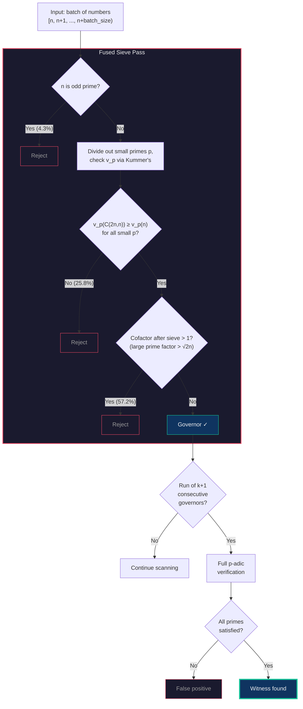

# Erdős Problem #396 — Witness Search

Paper companion repository for *[paper title TBD]*.

> For each *k*, find the smallest *n* such that *n*(*n*−1)(*n*−2)⋯(*n*−*k*) divides C(2*n*, *n*).

This project discovered the smallest witnesses for k = 8 through k = 13 via exhaustive search of up to 25 trillion integers, extending OEIS [A375077](https://oeis.org/A375077).

## Results

| k  | Smallest witness *n*  | Search range | Status            |
|----|----------------------|--------------|-------------------|
| 1  | 2                    | —            | Known (OEIS)      |
| 2  | 2,480                | —            | Known (OEIS)      |
| 3  | 8,178                | —            | Known (OEIS)      |
| 4  | 45,153               | —            | Known (OEIS)      |
| 5  | 3,648,841            | —            | Known (OEIS)      |
| 6  | 7,979,090            | —            | Known (OEIS)      |
| 7  | 101,130,029          | —            | Known (OEIS)      |
| 8  | 339,949,252          | 0–370M       | Found 2025-01-17  |
| 9  | 17,609,764,993       | 0–19.3B      | Found 2025-01-20  |
| 10 | 17,609,764,994       | 0–19.3B      | Found 2025-01-20  |
| 11 | 1,070,858,041,585    | 0–2T         | Found 2026-02-09  |
| 12 | 5,048,891,644,646    | 0–6.15T      | Found 2026-02-11  |
| 13 | 18,253,129,921,842   | 0–25T        | Found 2026-02-16  |

## How to verify our claims

Three independent verification paths:

```bash
# 1. Verify all 13 known witnesses (seconds)
cargo run --release --bin verify -- --known

# 2. Check the formal proof of the Small Prime Barrier Theorem (minutes)
cd formal && lake build

# 3. Validate minimality for k=13 via provably complete small-prime sieve (days)
cargo run --release --bin validate -- -k 13 --start 0 --end 18253129921842 --workers 40
```

Command (1) confirms each claimed witness satisfies the divisibility condition.
Command (2) machine-checks that checking barrier primes p < 2k+1 suffices to find
every witness (Theorem 1). Command (3) applies that theorem to prove no k=13 witness
exists below our claimed minimum.

## Method

All known witnesses have every block term in the **Governor Set** G = {n : n | C(2n, n)}
(OEIS [A014847](https://oeis.org/A014847), density ~12.3%). The search reduces to
finding runs of k+1 consecutive Governor Set members, then verifying each candidate
with a full p-adic valuation test. A fused sieve+governor computation rejects ~87%
of integers in a single pass using Kummer's theorem for v_p(C(2n, n)).

The **Small Prime Barrier Theorem** (proved in `formal/`) shows that any witness
invisible to the Governor Set sieve must have governor failures only at primes
p < 2k+1. For k=13, this is just 9 primes. The `validate` binary exploits this
to provide a provably complete second pass that checks every integer — not just
governors — confirming no witnesses were missed.

## Search Pipeline



Only ~12.6% of candidates survive the fused sieve (matching the Ford-Konyagin governor density).
Kummer's theorem replaces Legendre's formula for computing v_p(C(2n,n)), halving the number of
iterations per prime — and for p=2 it reduces to a single `POPCNT` instruction.

## Architecture

| File | Purpose |
|------|---------|
| `src/sieve.rs` | Prime sieve (Sieve of Eratosthenes) |
| `src/factor.rs` | Integer factorization via trial division |
| `src/governor.rs` | Governor Set membership via Kummer's theorem |
| `src/prefilter.rs` | Fused sieve+governor batch computation (hot loop) |
| `src/verify.rs` | Full witness verification with p-adic analysis |
| `src/search.rs` | Parallel search with rayon, run detection, checkpointing |
| `src/checkpoint.rs` | Checkpoint save/resume for long-running searches |
| `src/bin/verify.rs` | CLI for verifying individual or known witnesses |
| `src/bin/validate.rs` | Provably complete small-prime sieve (Corollary 6) |
| `formal/` | Lean 4 proof of the Small Prime Barrier Theorem |
| `docs/` | Mathematical exposition and validation architecture |

## Formal Verification

The `formal/` directory contains a standalone Lean 4 + Mathlib project that
machine-checks the Small Prime Barrier Theorem. See [`formal/README.md`](formal/README.md)
for build instructions and a summary of what is proven.

## Citation

```bibtex
@misc{dehorty2026erdos396,
  author = {Dehorty, Justin},
  title  = {Witness Search for {Erd\H{o}s} Problem \#396},
  year   = {2026},
  url    = {https://github.com/TODO}
}
```

## License

MIT — see [LICENSE](LICENSE).
