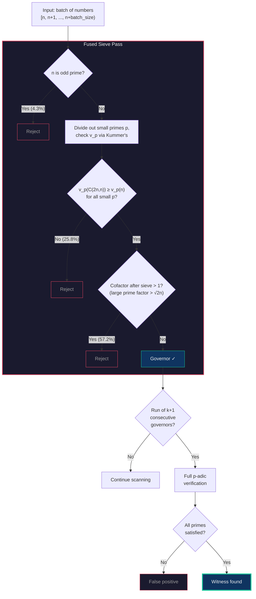

# Erdős Problem #396 — Witness Search

High-performance parallel search for witnesses to [Erdős Problem #396](https://www.erdosproblems.com/396) (OEIS [A375077](https://oeis.org/A375077)):

> For each *k*, find the smallest *n* such that *n*(*n*−1)(*n*−2)⋯(*n*−*k*) divides C(2*n*, *n*).

## Key Insight: Governor Set Approach

All known witnesses have every block term in the **Governor Set** G = {n : n | C(2n, n)}.
This reduces the search to finding runs of consecutive Governor Set members, then verifying
each candidate with a full p-adic valuation test.

## Building

```bash
cargo build --release
```

## Usage

### Search

```bash
# Search for k=9 witnesses in a range
cargo run --release -- --start 1000000 --end 2000000 -k 9

# Use a specific number of workers
cargo run --release -- --start 1000000 --end 2000000 -k 9 --workers 8

# List known witnesses
cargo run --release -- --list-known

# Verify all known witnesses
cargo run --release -- --verify-known
```

### Verification

```bash
# Verify a specific candidate
cargo run --release --bin verify -- -k 8 -n 339949252

# Verify all known witnesses
cargo run --release --bin verify -- --known
```

## Known Witnesses

The official sequence is OEIS [A375077](https://oeis.org/A375077) ([b-file](https://oeis.org/A375077/b375077.txt)), which currently lists k=1 through k=7:

| k  | Smallest witness n   | Status            |
|----|---------------------|-------------------|
| 1  | 2                   | Known (OEIS)      |
| 2  | 2,480               | Known (OEIS)      |
| 3  | 8,178               | Known (OEIS)      |
| 4  | 45,153              | Known (OEIS)      |
| 5  | 3,648,841           | Known (OEIS)      |
| 6  | 7,979,090           | Known (OEIS)      |
| 7  | 101,130,029         | Known (OEIS)      |
| 8  | 339,949,252         | Found 2025-01-17  |
| 9  | 17,609,764,993      | Found 2025-01-20  |
| 10 | 17,609,764,994      | Found 2025-01-20  |
| 11 | 1,070,858,041,585   | Found 2026-02-09  |
| 12 | 5,048,891,644,646   | Found 2026-02-11  |
| 13 | 18,253,129,921,842  | Found 2026-02-16 *(awaiting confirmation — 15T-18.25T not yet exhaustive)* |

The k=13 witness was found as a run of **14** consecutive Governor Set members starting at position 18,253,129,921,829. Confirmation that it is the *smallest* k=13 witness requires exhaustive search of the 15T-18.25T range (in progress on Chi, ETA ~2026-02-21).

Witnesses for k=8 through k=13 were discovered using this project and have not yet been added to the OEIS.

## How It Works

The search pipeline uses a fused sieve+governor computation to reject ~87% of candidates
in a single pass, then detects consecutive governor runs and verifies them:



Only ~12.6% of candidates survive the fused sieve (matching the Ford–Konyagin governor density).
Kummer's theorem replaces Legendre's formula for computing v_p(C(2n,n)), halving the number of
iterations per prime — and for p=2 it reduces to a single `POPCNT` instruction.

## Architecture

| File | Purpose |
|------|---------|
| `sieve.rs` | Prime sieve (Sieve of Eratosthenes) |
| `factor.rs` | Integer factorization via trial division |
| `governor.rs` | Governor Set membership checking via Kummer's theorem |
| `prefilter.rs` | Fused sieve+governor batch computation (performance-critical hot loop) |
| `verify.rs` | Full witness verification with p-adic analysis |
| `search.rs` | Parallel search with rayon, run detection, checkpointing |
| `checkpoint.rs` | Checkpoint save/resume for long-running searches |

## Checkpoints

Search progress is automatically saved to the output directory (default: `checkpoints/`).

**v3 architecture** (2026-02-20): Each worker maintains two files:
- `checkpoint_k{k}_w{id}.json` — Slim resume state (~750 bytes), overwritten atomically each cycle
- `runs_k{k}_w{id}.jsonl` — Append-only run log, one JSON line per significant run (length >= 6)

This decoupled design eliminates the I/O bottleneck that occurred with v2's cumulative checkpoints,
which grew to 34+ MB per worker on long searches. The v3 binary automatically migrates existing
v2 checkpoints on resume.

## License

MIT — see [LICENSE](LICENSE).
